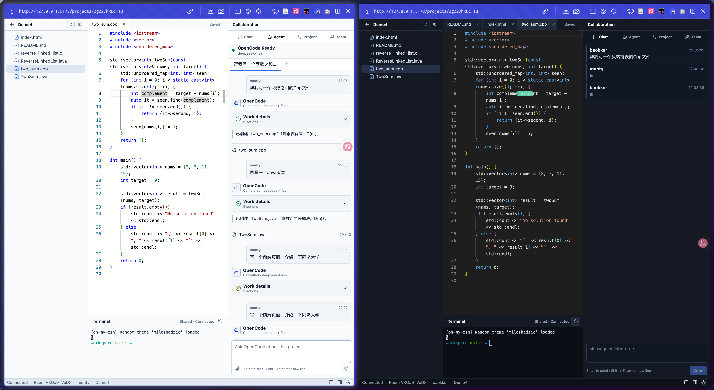

# SimpleRCPv2

SimpleRCPv2 是一个以服务端项目目录为代码来源的实时协同编程系统。用户在浏览器中选择项目，进入协作工作区，共同查看和编辑文件、聊天、观察成员状态并使用共享终端。

项目把代码、编辑器、终端、协作信息和 Coding Agent 放在同一个页面中。Agent 使用同一份服务端代码，任务状态、输出、文件变化和 trace 会显示在工作区中。

当前版本已经完成多项目、实时协作和 OpenCode Agent 基线。每位成员可以创建自己的任务或继续自己的 session；同一项目中的任务依次执行，不同项目可以同时执行。



## 当前功能

- 项目首页：打开或删除已登记项目、创建空白项目、导入服务端已有目录、导入 ZIP。
- 默认 Demo：首次启动时自动复制 `demo/workspace` 并登记为 Demo 项目。
- 服务端代码保存：全部项目位于 `.simplercp-data/projects/`，也可以通过环境变量指定其他绝对路径。
- 文件管理：按需读取文件树，支持创建、重命名和删除文件与目录。
- 代码编辑：使用 Monaco Editor 和 Yjs 同步多人文本编辑、光标和选区，并显示保存与同步状态。
- 实时协作：显示成员、当前文件、聊天消息和 Activity；聊天消息保存在服务端，文件编辑记录包含变化行号与增删行数。
- 共享终端：使用 `node-pty` 在当前项目目录中运行 shell，允许输入任意命令。
- 外部变化同步：监听终端或其他程序产生的文件变化，并更新文件树和已经打开的协作文档。
- 错误恢复：协作连接与终端连接会自动重连，离线后可以手动重试；项目被删除后返回项目首页。
- 工作区控制：文件操作使用应用内确认窗口，Terminal 与 Collaboration 面板可以从状态栏显示或隐藏。
- 日间模式与夜间模式：主题选择保存在当前浏览器中。
- Agent 设置：首页可以查看 OpenCode 状态和版本，设置 DeepSeek Model，并启用或停用 Agent。
- Agent 任务：项目侧栏可以创建任务、继续 session、取消自己的任务、查看队列位置、模型输出和文件变化。
- Agent trace：OpenCode SSE、状态、文件变化和并发修改提示按 JSONL 保存，可以在页面查看并下载。

## 配置与使用

环境要求：

- Node.js 20 或更高版本
- pnpm 9

1. 下载代码并安装依赖：

```bash
git clone https://github.com/Baokker/SimpleRCPv2.git
cd SimpleRCPv2
pnpm install
```

2. 从模板创建 `.env`：

```bash
cp .env.example .env
```

3. 在 `.env` 中填写 DeepSeek 配置。`DEEPSEEK_API_KEY` 是执行 Agent 任务所需的服务端密钥：

```dotenv
DEEPSEEK_API_KEY=your_deepseek_api_key
DEEPSEEK_BASE_URL=https://api.deepseek.com/v1
DEEPSEEK_MODEL=deepseek-flash
```

`.env` 已经加入 `.gitignore`，不会进入 Git 提交。OpenCode command 和 TypeScript SDK 会随项目依赖一起安装，无需单独安装 OpenCode。

4. 在仓库根目录启动客户端和服务端：

```bash
pnpm dev
```

5. 打开 `http://127.0.0.1:5173`。项目列表会显示内置 Demo，也可以创建空白项目、导入 ZIP，或者导入服务端已有目录。
6. 填写显示名称和可选角色，进入项目工作区。角色只用于界面显示，进入项目的成员拥有相同的文件与终端能力。
7. 在工作区中编辑文件、聊天、使用共享终端，或者在 `Agent` 页签向 OpenCode 提交任务。

默认地址为：

- 浏览器：`http://127.0.0.1:5173`
- 服务端：`http://127.0.0.1:4000`

启动命令无需填写 Workspace 参数。首次启动会创建 `.simplercp-data/`，并把仓库中的 `demo/workspace/` 复制到数据目录。浏览器项目列表中会直接显示 Demo。

Demo 只使用 Node.js 内置功能。进入 Demo 后可以在共享终端运行：

```bash
npm start
npm test
```

`DEEPSEEK_API_KEY` 留空时，文件协作、Chat 和共享终端仍可使用，Agent 页面会提示缺少 API Key。已经完成依赖安装与 `.env` 配置后，后续启动只需要运行 `pnpm dev`。

## 项目结构

```text
.
├── README.md
├── apps
│   ├── client
│   │   ├── index.html
│   │   ├── package.json
│   │   ├── src
│   │   └── vite.config.ts
│   └── server
│       ├── package.json
│       ├── src
│       └── vitest.config.ts
├── demo
│   └── workspace
├── docs
│   ├── product
│   └── research
├── scripts
│   └── start-demo.mjs
├── tests
│   ├── e2e
│   ├── fixtures
│   └── playwright.config.ts
├── package.json
├── packages
│   └── shared
├── pnpm-lock.yaml
├── pnpm-workspace.yaml
└── tsconfig.base.json
```

主要目录职责：

- `apps/client/`：React 浏览器客户端，包含项目首页、协作工作区、Monaco Editor、Yjs 客户端和共享终端界面。
- `apps/server/`：Express 与 WebSocket 服务，负责项目注册、代码保存、Room、Yjs 文档、终端、文件监听和 OpenCode 进程。
- `apps/server/src/agent/`：Agent 设置、OpenCode runtime、任务队列、工作区变化与 trace 存储。
- `packages/shared/`：客户端与服务端共同使用的项目、协作、Agent 和 WebSocket TypeScript 类型。
- `demo/workspace/`：首次启动时导入的数据示例项目。
- `docs/product/`：基线需求、开发计划、已知问题和后续改进方向。
- `docs/research/`：Agent runtime、文档同步和并行 Agent 等调研记录。
- `scripts/`：仓库启动辅助命令。
- `tests/e2e/`：项目流程、多人协作、主题和正式 Agent 运行的 Playwright 测试。
- `tests/fixtures/`：自动化测试使用的项目文件。

## 项目数据

默认数据目录为仓库根目录下的 `.simplercp-data/`：

```text
.simplercp-data/
├── registry.json
├── projects
│   └── <projectId>
│       ├── chat.json
│       ├── project.json
│       ├── workspace
│       ├── agent-sessions
│       │   └── <sessionId>
│       │       └── session.json
│       └── agent-runs
│           └── <runId>
│               ├── run.json
│               └── trace.jsonl
└── agent
    └── settings.json
```

`.simplercp-data/` 已经加入仓库的 `.gitignore`。`workspace/` 是浏览器、共享终端和 Agent 共同访问的代码目录，也是服务端保存代码的位置。

`chat.json` 在项目产生第一条聊天消息时创建，服务重新启动后继续读取。`agent/settings.json` 保存非敏感 Agent 设置，API Key 只从服务端环境变量读取。

导入服务端已有目录时，SimpleRCPv2 会把内容复制到新的 `workspace/`，原目录保持不变。导入 ZIP 和已有目录时会过滤 `.git`、`node_modules`、`__MACOSX` 和 `.DS_Store`。这些路径也不会出现在浏览器文件树和文件接口中。

从项目首页删除项目会停止该项目的运行资源，并删除 `.simplercp-data/projects/<projectId>/` 与 Registry 记录。导入项目的原目录不受影响。内置 Demo 始终保留。

可以指定其他数据目录，路径必须为绝对路径：

```bash
SIMPLERCP_DATA_DIR="/srv/simplercp-data" pnpm dev
```

部署时应当把该目录放在持久化存储中，并纳入备份范围。

## 配置

服务端启动时读取仓库根目录 `.env`。该文件已被 `.gitignore` 忽略，可以从 `.env.example` 开始填写。命令行环境变量的优先级高于 `.env`。

Agent 使用项目依赖中的 OpenCode `1.18.31` 和 `@opencode-ai/sdk` `1.18.31`，Provider 默认为 DeepSeek。OpenCode 由服务端启动并监听 `127.0.0.1`，浏览器无法读取 DeepSeek API Key，也无法直接访问 OpenCode 端口。

- `SIMPLERCP_DATA_DIR`：项目数据目录，默认值为仓库根目录下的 `.simplercp-data/`，设置值必须为绝对路径。
- `SIMPLERCP_HOST`：服务端监听地址，默认值为 `127.0.0.1`。
- `SIMPLERCP_PUBLIC_URL`：用户访问的浏览器地址，默认值为 `http://127.0.0.1:5173`。
- `SIMPLERCP_SHELL`：共享终端使用的 shell 路径，默认读取当前进程的 `SHELL`，随后使用 `/bin/sh`。
- `PORT`：服务端端口，默认值为 `4000`。
- `VITE_SIMPLERCP_CLIENT_HOST`：开发客户端监听地址，默认值为 `127.0.0.1`。
- `VITE_SIMPLERCP_CLIENT_PORT`：开发客户端端口，默认值为 `5173`。
- `VITE_SIMPLERCP_API_ORIGIN`：开发客户端代理连接的服务端地址，默认值为 `http://127.0.0.1:4000`。
- `DEEPSEEK_API_KEY`：DeepSeek API Key，Agent 任务需要该变量。
- `DEEPSEEK_BASE_URL`：OpenAI-compatible API 地址，默认值为 `https://api.deepseek.com/v1`。
- `DEEPSEEK_MODEL`：Agent 使用的 Model；`.env.example` 配置为 `deepseek-flash`，环境变量缺失时服务端使用 `deepseek-chat`。
- `SIMPLERCP_OPENCODE_PORT`：OpenCode 回环端口，默认值为 `4096`。
- `SIMPLERCP_AGENT_RUN_TIMEOUT_MS`：单个任务最长运行时间，默认值为 `600000`。

启动以后，可以在项目首页的 Agent 设置页面查看 OpenCode 状态、版本和 Model，并启用或停用 Agent。新任务创建 OpenCode session；在当前成员的 session 中继续输入时，会复用同一个 OpenCode session。存在运行中或排队任务时，服务端会拒绝修改 Model 或 Enabled，防止执行过程被配置变化中断。

## 公网访问

下列命令用于开发环境的远程访问，可以同时配置服务端和客户端的监听地址：

```bash
SIMPLERCP_HOST="0.0.0.0" \
SIMPLERCP_PUBLIC_URL="https://code.example.com" \
VITE_SIMPLERCP_CLIENT_HOST="0.0.0.0" \
VITE_SIMPLERCP_API_ORIGIN="http://127.0.0.1:4000" \
pnpm dev
```

公网部署建议由同一个域名提供页面和接口。反向代理需要转发普通 HTTP 路径 `/api`，并为 `/ws`、`/yjs` 和 `/terminal` 开启 WebSocket 转发。页面使用 HTTPS 时，浏览器会自动使用 WSS。

当前版本允许项目成员运行任意 shell 命令，并直接访问服务端项目目录。公网部署需要在可信网络、VPN 或外部身份认证之后提供访问，不应直接开放为匿名公共服务。相关限制见 [已知问题](./docs/product/known-issues.md)。

仓库当前提供 Vite 开发服务和构建命令，没有提供生产环境进程管理与静态文件服务。正式部署需要由部署环境提供静态文件服务、Node.js 服务进程和反向代理。

## 测试与构建

运行服务端测试、Demo 测试和启动测试：

```bash
pnpm test
```

`.env` 同时配置 `DEEPSEEK_API_KEY` 和 `DEEPSEEK_MODEL` 时，`pnpm test` 会运行正式 OpenCode 与 DeepSeek 集成测试，并向 Provider 发出请求。缺少配置时，这些集成测试会自动跳过。

首次运行浏览器自动化测试时安装 Playwright 浏览器：

```bash
pnpm exec playwright install
```

Linux 环境需要同时安装系统依赖时运行 `pnpm exec playwright install --with-deps`。随后运行：

```bash
pnpm test:e2e
```

浏览器 Agent 用例在 `DEEPSEEK_API_KEY` 已配置时向 Provider 发出请求；缺少 API Key 时自动跳过。

运行 TypeScript 检查并构建客户端与服务端：

```bash
pnpm build
```

## 相关文档

- [文档索引](./docs/README.md)：全部产品与调研文档入口。
- [基线需求](./docs/product/2026-09-17-baseline.md)：完整产品流程、功能范围和验收条件。
- [开发计划](./docs/product/2026-09-17-development-plan.md)：模块职责、开发顺序和测试范围。
- [已知问题](./docs/product/known-issues.md)：成员、终端和 Agent 同时修改文件等当前限制。
- [改进方向](./docs/product/improvement-roadmap.md)：并行 Agent、任务目录、运行恢复和 trace 分析方向。
- [Agent runtime 调研](./docs/research/2026-09-17/agent-runtime.md)：OpenCode、DeepSeek、session 和 trace 调研。
- [文档同步调研](./docs/research/2026-09-17/document-sync.md)：磁盘、Yjs、终端和 Agent 同时修改文件时的同步处理。
- [Agent 并行执行调研](./docs/research/2026-09-17/parallel-agent.md)：多 session、独立工作目录和并行处理方式。
- [协作记录保存调研](./docs/research/2026-09-21/collaboration-history-persistence.md)：Activity、Agent 会话、身份归属与服务重新启动后的数据边界。

当前基线的后续改进集中在 Agent 写入的三方合并、同一项目并行任务、运行隔离和更完整的 trace 分析，详情见[改进方向](./docs/product/improvement-roadmap.md)。
