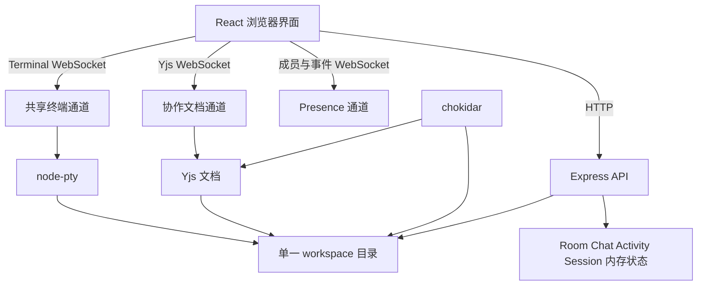
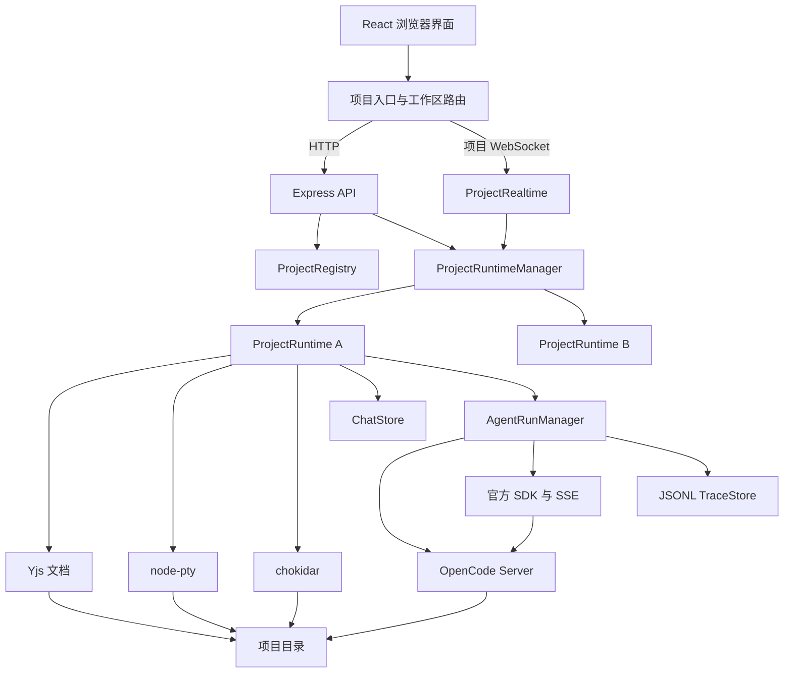

# SimpleRCPv2 运行系统基线需求

状态：讨论稿

更新时间：2026-09-17

同步层的设计依据见 [文档同步设计](./07-document-sync-design.md)，落地步骤与阶段划分见 [基线实施计划](./08-implementation-plan.md)。本文只定义需求与架构契约，不重复设计推导过程。

## 1. 产品目标

SimpleRCPv2 面向可信团队中的代码协作。服务端管理项目目录、协作会话、共享终端和 Agent 进程；浏览器提供项目入口、代码编辑、聊天、成员状态、终端和 Agent trace。

基线版本需要满足以下目标：

- 用户从网页选择已有项目、登记服务端项目目录、上传 ZIP，或创建空白项目。
- 用户进入项目时填写名称，可选填写角色；未填写角色时使用 `Collaborator`。
- 项目成员默认拥有文件编辑、文件管理、终端和 Agent 调用能力。
- 多位用户可以同步编辑代码、查看光标、聊天和共用终端。
- 服务端提供一个通用 `AgentRuntime` 接口，基线接入 OpenCode；Provider 默认使用 DeepSeek。
- 每位项目成员可以发起自己的 Agent run；每个独立任务拥有自己的 Agent session，同一任务的继续消息复用该 session。
- Agent 由服务端直接启动，工作目录自动使用当前项目目录。
- API Key 在系统 Agent 设置中配置，由服务端统一保存和使用，浏览器无法读取已保存的明文。
- Agent 的输出、工具调用、命令、文件变化、错误和最终消息形成可查看、可下载的 trace。
- 核心路径由少量单元测试和 Playwright E2E 覆盖。

基线版本不包含以下能力：

- 多种 Agent 的选择与编排。
- 自定义 Agent command、启动参数和插件市场。
- Host、Guest 与多级权限矩阵。
- 命令白名单和快捷命令运行器。
- Agent Proposal、逐文件 Apply、Reject 和三方合并。
- 公网多租户、安全沙箱、计费和团队管理。
- 多种压缩格式和跨项目覆盖导入。

服务只能运行在可信网络中。共享终端和 Agent 都可以访问项目目录，公开部署不属于基线使用范围。

## 2. 当前架构



当前服务启动时从 `SIMPLERCP_WORKSPACE` 读取一个目录，并为该目录创建一个 room、一个共享 PTY、一个文件 watcher 和一组 Yjs 文档。浏览器启动后直接加入该 room，没有项目选择页面。

当前代码由以下部分组成：

- 服务端产品代码约 2,211 行，主要文件为 `createApp.ts`、`realtime.ts` 和 `rooms.ts`。
- 浏览器产品代码约 3,277 行，其中 `App.tsx` 为 655 行，样式文件为 793 行，组件代码为 1,408 行。
- 自动化测试约 1,593 行，包含 34 个服务端用例、一个 579 行协作 E2E 和一个 159 行录制用例。
- `createApp.ts` 注册 21 个 HTTP 路由。
- `realtime.ts` 同时管理成员事件、Yjs 升级请求和终端连接。
- `App.tsx` 管理 16 组界面状态和 9 个引用，同时负责启动、项目文件、聊天、成员、设置、终端和 watcher 刷新。

## 3. 当前复杂度

当前复杂度属于中等规模，风险集中在少数文件和跨通道状态同步。

### 3.1 状态来源较多

同一项目同时存在磁盘文件、Yjs 文档、浏览器 Monaco model 和 watcher 事件。协作编辑写入 Yjs，Yjs 延迟写入磁盘，终端和外部程序写入磁盘，watcher 又把变化同步回 Yjs。这个环路是当前最重要的正确性边界，而现有实现里存在两个已确认缺陷。

第一，回声抑制的判据是把磁盘内容与当前 Yjs 内容比较。写盘到 watcher 回调之间至少有 100 毫秒延迟，成员在这个窗口内继续输入会让判据失效，代码进入覆盖分支并回滚刚输入的字符。这是今天就能复现的数据丢失，不需要 Agent 参与。

第二，外部变化的应用方式是 `text.delete(0, text.length)` 加 `text.insert(0, content)`。它让文件中每个字符获得新的 CRDT 标识，所有在线成员的光标与选区随之错位，Yjs 更新体积也按文件大小增长。当前外部写入很少，Agent 接入后会变成常态。

两个缺陷的成因、业界对照与修复方案见 [文档同步设计](./07-document-sync-design.md)，本文第 7 节给出必须遵守的架构不变量。

### 3.2 通信路径较多

HTTP 负责文件、聊天、设置和命令；成员状态使用一个 WebSocket；Yjs 使用另一个 WebSocket；终端使用第三个 WebSocket。聊天和 Activity 仍以 1.5 秒轮询补充刷新，形成 WebSocket 与轮询并存的模式。

### 3.3 权限代码超过原型需要

Host token、Host session、Guest 三项权限、两种命令模式、命令白名单和多处服务端校验共同形成一条独立功能链。基线版本面向可信成员，保留这条链会增加入口、设置界面、API 和测试数量。

### 3.4 前端总控组件职责过多

`App.tsx` 同时承担启动流程、通信连接、文件树缓存、编辑器标签页、聊天、成员跟随、终端命令和 Session 设置。加入项目入口与 Agent 后继续向该文件增加状态，会增加修改风险。

### 3.5 E2E 覆盖范围过宽

当前单个协作 E2E 同时验证身份、目录懒加载、外部文件变化、大文件、二进制文件、权限切换、Python 补全、标签页、文件管理、协作编辑、聊天、终端、Activity 和布局。一次失败很难快速定位原因，部分断言与基线核心路径关系较弱。

## 4. 当前功能

当前已经可以使用的能力：

- 打开服务启动参数指定的单一项目目录。
- 浏览、新建、重命名和删除文件与目录。
- 延迟加载目录和文件，并识别二进制文件与大文本文件。
- 使用 Monaco 编辑多种文本文件。
- 通过 Yjs 合并多位用户的同步编辑。
- 展示远端光标、选区、成员状态和当前文件。
- 跟随另一位成员打开的文件和光标位置。
- 发送项目 room 内聊天消息。
- 查看 Activity。
- 共用一个位于项目目录的 PTY。
- 通过 Host 页面修改终端与 Guest 权限。
- 监听终端和其他程序产生的文件变化，并同步到编辑器。

当前缺少的能力：

- 项目列表、项目登记和空白项目创建。
- 多项目运行时管理。
- 项目进入页面与可选角色。
- Agent 配置、启动、取消和 trace。
- 服务端 Agent API Key 保存。
- Agent 运行历史。
- 服务重新启动后的项目登记信息和 Agent trace。

## 5. 基线产品流程

### 5.1 打开系统

1. 用户访问根路径 `/`。
2. 页面显示项目列表，每项展示名称、服务端目录、最近打开时间和 Agent 配置状态。
3. 用户可以选择 `Open`、`Import zip`、`Add existing project` 或 `New empty project`。
4. 项目列表为空时，页面直接展示新增项目表单。

`Add existing project` 接收服务端目录绝对路径和可选名称。服务端验证目录存在、属于目录类型，并确保同一路径只登记一次。该操作只登记路径，不复制项目内容。

`New empty project` 接收项目名称。服务端在 `SIMPLERCP_PROJECTS_ROOT` 下创建同名目录，并登记项目。名称必须经过路径校验，不能包含目录跳转内容。

`Import zip` 只接受一个 `.zip` 文件和项目名称。服务端先把归档写入受控数据目录，再逐项检查归档路径和文件类型，确认全部检查通过后解压到新项目目录并登记项目。导入过程不能覆盖已有项目。

压缩包导入规则：

- 只支持 `.zip`。默认限制为：压缩包最大 200 MiB，最多 50,000 个条目，解压后总大小最大 1 GiB，单个文件最大 128 MiB；服务端在接收和解压过程中都检查这些限制。
- 限制通过 `SIMPLERCP_IMPORT_MAX_ARCHIVE_BYTES`、`SIMPLERCP_IMPORT_MAX_ENTRIES`、`SIMPLERCP_IMPORT_MAX_TOTAL_BYTES` 和 `SIMPLERCP_IMPORT_MAX_FILE_BYTES` 配置，配置值不能超过服务端允许的安全上限。
- 归档条目必须是相对路径，拒绝绝对路径、目录跳转路径、符号链接、硬链接和设备文件。
- 服务端拒绝解压后超出项目目录的路径，并在发现一个非法条目时终止整个导入。
- 固定过滤路径段为 `node_modules`、`.git`、`__MACOSX`，固定过滤文件名为 `.DS_Store`；这些条目不会写入新项目。
- 过滤结果显示在导入结果中，包含条目数量和忽略原因；用户不需要逐个确认。
- 导入失败时删除未完成的新项目目录，项目列表不增加半成品项目。

现有项目登记只保存服务端路径，不复制项目内容，也不按照压缩包过滤规则删除已有文件。

### 5.1.1 文件树和文件内容

文件树采用按目录读取的方式。打开项目时只读取根目录的条目名称、类型和相对路径；用户展开目录时才读取该目录下一层，点击文件时才读取文件内容。文件树不把整个项目读入浏览器。

以下固定噪声路径默认不出现在文件树，也不触发 workspace watcher 的协作事件：

- 路径段为 `node_modules`、`.git`、`__MACOSX` 的目录及其全部内容。
- 文件名为 `.DS_Store` 的文件。

这些路径在现有项目中保留在磁盘上。终端命令仍然可以访问，OpenCode 进程也可以在项目目录中访问；服务端不会主动把这些路径内容提供给浏览器或 Agent 上下文。基线版本不提供“显示忽略路径”开关，也不支持通过网页文件接口读取、写入、创建或删除这些路径。

其他目录，例如 `dist/`、`build/`、`target/`、`.venv/` 和 `coverage/`，不加入固定忽略名单。它们可能包含项目需要的内容，按普通目录处理；大文件和二进制文件仍沿用已有的打开确认规则。

这套规则分为三个层次：

1. ZIP 导入过滤：过滤条目不会写入新项目。
2. 浏览器文件接口过滤：文件树、文件读取、文件写入和文件管理接口都拒绝固定噪声路径。
3. 协作 watcher 过滤：固定噪声路径的磁盘变化不创建 Yjs 文档，也不广播文件变化。

Agent 不会因为进入项目就读取或上传整个文件树。Agent 只在工具调用中读取它需要的路径。OpenCode 可以通过自身工具或命令访问项目目录中的固定噪声路径；服务端记录该行为，但不把它当作浏览器协作文件同步。这样可以避免预先加载依赖目录，同时保留项目命令正常运行所需要的文件。

### 5.2 进入项目

1. 用户点击项目的 `Open`。
2. 页面显示进入表单：显示名称为必填项，角色为可选文本字段。
3. 角色为空时显示为 `Collaborator`；用户填写的文本只用于成员列表和协作语境，不参与权限判定。
4. 用户进入 `/projects/:projectId`，服务端为该项目建立或复用 `ProjectRuntime`。
5. 页面连接项目成员通道、Yjs 文档通道和共享终端。

所有成员默认可以编辑文件、管理文件、输入终端和启动 Agent。页面不显示 Host、Guest、命令模式和 Guest 权限设置。

### 5.3 进行代码协作

工作区保持四个稳定区域：

- 左侧：项目文件树。
- 中间：Monaco 编辑器和文件标签页。
- 底部：共享终端。
- 右侧：`Chat`、`People`、`Agent`、`Project` 四个标签页。

`Chat` 只处理成员消息。`People` 展示在线成员、角色、当前文件和跟随按钮。常规 Activity 不再作为独立信息流展示。文件变化通过文件树和编辑器体现，终端输出留在终端，Agent 行为留在 Agent trace。

共享终端始终启用直接输入。界面保留重启按钮，删除命令下拉框、Run 按钮、白名单和模式标记。

### 5.4 配置 Agent

用户在项目首页打开 `Agent settings`，也可以从工作区的 Agent 标签页进入。页面包含以下字段：

- Agent：固定显示 `OpenCode`，不可修改。
- Agent mode：固定显示 OpenCode 内置 `build` Agent。
- Provider：固定显示 `DeepSeek`。
- Model：默认值由服务端配置提供，可以修改。
- API Key：写入时显示密码输入框；保存后只显示 `Configured`，服务端响应不包含明文。
- Enabled：控制全部项目能否启动 Agent。

API Key 的作用范围是当前 SimpleRCPv2 服务。全部项目共用该配置。服务端把密钥保存在自身数据目录中，设置文件权限为当前服务用户可读写。日志、聊天、trace、错误消息和浏览器接口不得包含密钥。

页面同时显示以下检查结果：

- OpenCode command 是否可用。
- OpenCode 版本。
- Model 与 API Key 是否已配置。

检查过程不调用模型，不产生 API 费用。

服务端通过 `OPENCODE_CONFIG_DIR` 使用独立配置目录，通过 `OPENCODE_CONFIG_CONTENT` 设置 Model、`default_agent: "build"` 和 `share: "disabled"`。项目已有 `opencode.json` 时，页面显示 OpenCode API 返回的生效 Model 与 Agent，避免设置页和运行状态出现差异。

### 5.5 启动 Agent

1. 用户进入 `Agent` 标签页。
2. 用户填写任务说明，可以附带当前文件路径和当前选区。
3. 用户点击 `Run Agent`。
4. 服务端检查 Agent 已启用和 API Key 已配置。
5. 服务端为新任务生成新的 `sessionId`；用户点击“继续”时沿用调用方传入的 `sessionId`。
6. 服务端记录本次 run 涉及路径的内容哈希，用于结束时的并发判定。磁盘内容因写穿机制始终最新，不存在启动前刷盘步骤。
7. `OpenCodeRuntime` 在回环地址启动 `opencode serve`，`cwd` 指向项目目录，并使用受控配置与环境变量。
8. 服务端通过官方 `@opencode-ai/sdk` 复用该成员的 session，订阅 SSE 并提交异步 prompt。
9. Agent 直接在项目目录中读取、修改文件和执行命令。
10. watcher 把 Agent 产生的文件变化同步到 Yjs 和所有浏览器。
11. Agent 结束后，服务端读取 session status 与 diff，记录耗时、费用、token 和变化文件列表。

每位成员可以连续发起多个任务，每个任务拥有独立 session；同一任务的后续消息形成该 session 的后续 turn。不同成员的 run 可以同时进入队列，但基线版本对同一个项目采用单写入队列：同一时间只有一个 Agent run 可以执行文件修改和命令，其他 run 显示为 `queued`。这样每个人都可以发起任务，项目文件仍按明确顺序变化。

Agent 与成员同时编辑同一文件仍可能产生覆盖或混合内容。Agent 运行期间，编辑器顶部显示当前 Agent 的成员名称和已操作文件。基线版本不增加 Proposal 和自动合并界面；Agent run 开始前记录文件版本，run 结束后若发现同一文件存在成员编辑，标记 `concurrent_change`，在 trace 和文件标签页显示警告，并保留最终磁盘内容供成员处理。

基线版本明确采用以下并发规则：

- 不同成员可以同时提交任务。
- 同一项目的任务进入一个 FIFO 写入队列。
- 队列只限制 Agent run，不限制成员继续编辑和使用共享终端。
- 一个 Agent run 内部允许 OpenCode 按自身能力并行调用工具。
- 服务端不做隐藏覆盖、自动 diff3 或自动回退。
- 后续需要真正并行时，先引入单个全局 shell 锁，再考虑每个 run 独立工作副本和显式合并流程。真正无法并行的是 shell，不是文件系统。

FIFO 的粒度取 run 而不是文件或工具。一次 run 内部是读取、判断、修改、验证的有状态序列，交错执行会让 Agent 基于过期读取行动。

队列必须具备终止性，以下三条是硬要求。

- 每个 run 有硬超时 `SIMPLERCP_AGENT_RUN_TIMEOUT_MS`，默认 10 分钟。超时后调用 session abort、标记 `failed`，无论 abort 是否成功都释放队列。缺少这条时，一个卡住的 OpenCode 进程会永久阻塞该项目的 Agent 能力。
- 队列位置、前面的成员与任务在界面上可见，`queued` 状态的 run 可以直接取消，不需要等它开始运行。
- 服务启动时把状态为 `running` 或 `queued` 的历史记录统一标记为 `failed`，原因写 `server_restarted`。缺少这条时，重启会留下永不结束的假运行记录。

### 5.6 查看 trace

Agent 标签页包含当前 run 和最近 run 列表。当前 run 按顺序展示：

- `queued`、`running`、`completed`、`failed`、`cancelled` 状态，`queued` 时显示队列位置。
- Agent 文本消息。
- 思考信息；仅展示 Agent 正式输出的可用内容。
- 工具名称、开始时间、结束时间和结果状态。
- 权限相关事件的记录。基线在 OpenCode 配置中全部放行，不提供交互式回复，事件仍写入 trace 供事后审查。
- 文件读取、文件修改和文件创建路径。
- 命令、退出码、耗时和输出摘要。
- 错误消息。
- 最终消息和变化文件列表。

工具事件默认收起，点击后展示完整参数与结果。页面提供 `Download trace`，下载服务端保存的 JSONL。原始事件和标准事件都要保留，方便后续分析 Agent 行为。

用户可以点击 `Cancel` 终止当前 run，也可以取消尚在排队中的 run。服务端对运行中的 run 调用 OpenCode session abort，对排队中的 run 直接移出队列并标记 `cancelled`。终端状态与项目 room 不受影响。

基线采用全局单个 OpenCode 进程与全局单个队列，而不是每个项目一个进程。每项目一个进程需要额外实现进程数上限、内存上限、LRU 回收、空闲超时与端口分配，这些机制只服务于进程管理本身。代价是跨项目任务也要排队，在可信小团队的使用强度下可以接受。

### 5.7 离开和重新进入

用户关闭页面后，成员连接变为离线。项目文件、项目登记、Agent 配置和 Agent trace 继续保留。聊天和成员在线状态可以保存在服务内存中，服务重新启动后允许清空。

## 6. Agent 接入决定

基线使用 `opencode serve`、官方 TypeScript SDK、HTTP API 和 SSE。服务端管理 OpenCode Server 进程，并通过 `OpenCodeRuntime` 转换事件。ACP 保留为未来可增加的 runtime 类型，当前代码不包含 ACP client。

选择 OpenCode Server API 的原因：

- 当前只接入一个 Agent 实现，不需要在界面提供 Agent 选择器。
- 项目路径由 `ProjectRuntime` 提供，用户无需在命令行输入目录和角色。
- OpenCode Server 提供 session、异步 prompt、abort、diff、status、permission 和 SSE 事件。
- 官方 SDK 提供 TypeScript 类型，服务端无需维护逐行 CLI 输出规则。
- 进程启动、取消、超时、退出码和 stderr 都由现有 Node.js 服务管理。
- ACP 的 session、capability、permission 和文件工具映射会增加状态数量。
- OpenCode 在 ACP 模式下仍可能通过自身工具访问 `cwd`，协议层无法自动提供文件审阅边界。

`AgentRuntime` 只定义当前产品需要的能力：

```ts
interface AgentRuntime {
  startProject(projectPath: string): Promise<void>;
  createRun(input: AgentRunInput): Promise<AgentRunRecord>;
  subscribe(runId: string): AsyncIterable<AgentTraceEvent>;
  cancel(runId: string): Promise<void>;
  getDiff(runId: string): Promise<AgentFileDiff[]>;
  stopProject(projectPath: string): Promise<void>;
}
```

该接口不暴露 ACP 名词。未来增加 ACP 时，可以新增 `AcpAgentRuntime`，项目、run 和 trace 数据结构无需变化。

接口不包含 `replyPermission`。服务只运行在可信网络，共享终端本来就允许任意命令，对 Agent 命令单独设卡在威胁模型上不成立；交互式权限回复还会成为队列之外的第二个死锁来源，发起者离开页面后 run 会无限期停在等待状态并持续占用队列。

同一接口另有一个用于测试的实现 `FakeAgentRuntime`，按脚本产生事件序列，可以模拟慢速运行、写入指定文件、抛错和卡住不返回。

Agent 候选与来源见 [开源 Agent 与 trace 调研](./04-agent-runtime-research.md)。

## 7. 目标架构



### 7.0 架构不变量

以下五条是实现与评审的共同契约。违反其中任意一条都属于正确性问题，不是优化空间。

1. **磁盘是唯一真相源，并且永远最新。** Yjs 文档的每次更新立即写盘，没有 debounce，没有 flush 阶段。任意时刻启动的 grep、构建、测试命令读到的都是成员当前所见内容。这条不变量让 Agent 使用磁盘工具成为结构性保证，而不是依赖时序推理。
2. **回声抑制以「本进程最近写出的内容哈希」为判据。** 不使用文件 mtime，不使用「与当前 Yjs 内容相同」。
3. **外部内容并入 `Y.Text` 必须是最小 delta。** 禁止 `delete(0, length)` 加 `insert` 的全量覆盖，未改动区域的字符标识必须保持不变。
4. **一个 Agent run 是队列单元，并且保证结束。** 硬超时、强制释放队列、重启时标记失败三者缺一不可。
5. **API Key 只存在于一个位置。** 服务端 secrets 文件，权限 0600，仅通过环境变量注入子进程。不调用 OpenCode 的 auth API，不写入项目目录，不出现在任何 HTTP 响应、日志、trace 或聊天消息中。

第 1 条到第 3 条的推导过程见 [文档同步设计](./07-document-sync-design.md)。

### 7.1 ProjectRegistry

`ProjectRegistry` 保存项目元数据：

```ts
interface ProjectRecord {
  id: string;
  name: string;
  rootPath: string;
  createdAt: string;
  lastOpenedAt: string;
}
```

项目元数据写入 `SIMPLERCP_DATA_DIR/projects.json`。服务端以单进程方式更新该文件，并通过同目录临时文件和 rename 完成替换。API Key 写入独立 secrets 文件，不进入 `ProjectRecord`。

### 7.2 ProjectRuntimeManager

`ProjectRuntimeManager` 按 `projectId` 延迟创建 `ProjectRuntime`。每个 runtime 拥有：

- 一个 `RoomStore`。
- 一个 `ChatStore`。
- 一个 `CollaborativeDocumentStore`。
- 一个共享 PTY。
- 一个 workspace watcher。
- 一个 `OpenCodeRuntime` 和 `AgentRunManager`。

runtime 在最后一位成员离开并且没有 Agent run 时，可以在空闲超时后释放 PTY、watcher 和 Yjs 文档。项目记录不受影响。

### 7.3 AgentRunManager

`AgentRunManager` 管理 run 的创建、排队、超时、取消与状态广播。一个 session 可以拥有多个按顺序执行的 run；一个成员可以拥有多个 session。项目可以同时存在多个成员 session，执行阶段按队列顺序进行。

运行数据只有一张表。`sessionId` 是 `AgentRunRecord` 的字段，session 列表通过对 run 记录按 `sessionId` 分组得到。原设计另有一张 `AgentSessionRecord`，但它的全部属性都可以从 run 推导，`createdAt` 是该 session 第一条 run 的 `startedAt`，`lastUsedAt` 是最后一条 run 的 `startedAt`，成员归属在每条 run 上都有。独立表带来的只是一份需要同步维护的派生数据。

```ts
interface AgentRunRecord {
  id: string;
  projectId: string;
  memberId: string;
  sessionId: string;
  requestedBy: string;
  prompt: string;
  status: "queued" | "running" | "completed" | "failed" | "cancelled";
  queuePosition?: number;
  startedAt: string;
  endedAt?: string;
  failureReason?: "timeout" | "server_restarted" | "runtime_error";
  changedFiles: string[];
  concurrencyWarning?: "concurrent_change";
  tracePath: string;
}

interface AgentTraceEvent {
  runId: string;
  sequence: number;
  timestamp: string;
  kind:
    | "message"
    | "tool_started"
    | "tool_completed"
    | "file_changed"
    | "command"
    | "permission"
    | "error"
    | "status";
  summary: string;
  rawType: string;
  data: Record<string, unknown>;
}
```

OpenCode Server 只绑定 `127.0.0.1` 和服务端分配的空闲端口，该端口不提供给浏览器。OpenCode SSE 事件通过官方 SDK 类型读取。无法识别的事件仍保存为原始事件；缺少 run 关键字段时立即将 run 标记为 `failed`。开发时固定 OpenCode 与 `@opencode-ai/sdk` 版本，升级时运行完整 Agent E2E。

### 7.4 TraceStore

每个 run 对应一个 JSONL 文件：

`SIMPLERCP_DATA_DIR/runs/<projectId>/<runId>.jsonl`

每行包含原始事件、标准事件、服务端接收时间和 sequence。run 列表使用同目录 `index.json`。写入顺序由单个 run writer 保证。

### 7.5 DocumentSync

`CollaborativeDocumentStore` 承担第 7.0 节第 1 条到第 3 条不变量，职责为三项。

- Yjs 到磁盘的写穿，按文件串行化，来自文件系统 origin 的更新不回写。
- 磁盘到 Yjs 的回声抑制与最小 delta 应用，判据为有界的写出哈希环。
- 文档生命周期。没有成员打开的文件不创建 `Y.Doc`，外部变化只广播文件树变更；文件被删除或类型变为非文本时停止持久化并通知客户端。

固定噪声路径过滤由 `workspacePolicy.ts` 提供唯一实现，同时供 ZIP 导入、浏览器文件接口和 watcher 使用。watcher 必须配置 `ignored`，否则 Agent 执行一次依赖安装或 git 操作会产生数万个事件。

原设计中的 `flushAll` 与 `persistDelayMs` 一并删除。不变量 1 成立后刷盘调用没有意义，保留它还会让人误以为不调用磁盘就可能过期。

## 8. HTTP 与 WebSocket 接口

项目接口：

- `GET /api/projects`
- `POST /api/projects/import`
- `POST /api/projects/import-zip`
- `POST /api/projects`
- `GET /api/projects/:projectId`

全局 Agent 设置接口：

- `GET /api/agent/settings`
- `PUT /api/agent/settings`
- `GET /api/agent/installation`

工作区、room、chat 和文件接口全部增加 `projectId`。示例：

- `GET /api/projects/:projectId/workspace/directory`
- `GET /api/projects/:projectId/workspace/file`
- `POST /api/projects/:projectId/members`
- `GET /api/projects/:projectId/chat`

Agent 接口只有五个。session 相关的三个接口随 `AgentSessionRecord` 一并删除，权限回复接口随交互式权限删除。

- `POST /api/projects/:projectId/agent/runs`，请求体可选携带 `sessionId`，缺省表示新任务。
- `GET /api/projects/:projectId/agent/runs`，支持按 `sessionId` 过滤。
- `GET /api/projects/:projectId/agent/runs/:runId`
- `GET /api/projects/:projectId/agent/runs/:runId/trace`
- `POST /api/projects/:projectId/agent/runs/:runId/cancel`，对运行中与排队中的 run 都有效。

文件变更接口只返回受影响目录的条目，不返回完整递归树。`listWorkspaceTree` 及其四处调用一并删除，全量递归树与按需加载的决定直接冲突。

WebSocket 只有两个通道。项目通道承载成员、聊天、项目文件变化、终端输入输出、Agent run 状态和 Agent trace 事件；终端的客户端消息本来就是 JSON 格式，并入成本很低。Yjs 保留独立通道，因为它使用二进制协议并由 `y-websocket` 管理生命周期。

聊天只有一条数据路径。浏览器通过项目 WebSocket 发送消息，服务端写入 `ChatStore` 后广播给房间全体，包括发送者自己；历史消息只在进入项目时拉取一次。现有的 HTTP POST 加 WebSocket 推送加 HTTP 重新拉取加轮询四条路径全部收敛，其中收到 WebSocket 消息后再发一次 HTTP 请求是明确的反模式。

## 9. 界面要求

### 9.1 项目入口

- 页面以项目列表为主体，不使用宣传页结构。
- 每个项目只显示名称、路径、最近打开时间、Agent 状态和 `Open`。
- `Add existing project` 与 `New empty project` 使用简短表单。
- 页面提供全局 `Agent settings` 入口。
- 路径错误直接显示在对应输入框下方。
- 最近打开项目排在前面。

### 9.2 工作区

- 文件树、编辑器、终端和右栏在桌面宽度下同时可见。
- 窄窗口允许右栏覆盖切换或移动到编辑器下方，终端与右栏不能互相遮挡。
- 用户进入项目后直接看到代码工作区，不增加引导页面。
- 当前项目名称提供返回项目列表的入口。
- 角色显示在 People 列表中，不占用状态栏主要空间。

### 9.3 Agent

- Agent 输入框提供一个明确的 `Run Agent` 按钮。
- active run 状态始终可见。
- trace 使用顺序列表，状态、消息、工具和错误拥有不同图标。
- 文件路径可以点击并在编辑器中打开。
- 命令输出使用等宽文本区域并限制默认高度。
- `Cancel` 在 active run 和 queued run 中都显示。
- `queued` 的 run 显示队列位置、前面的成员与任务摘要。
- 配置缺失时，Agent 标签页直接提供进入设置的按钮。
- 页面不显示 API Key 明文。

## 10. 代码开发范围

### 10.1 服务端新增模块

- `projects.ts`：项目登记、目录验证、空白项目创建和元数据保存。
- `archiveImport.ts`：ZIP 大小检查、条目检查、固定过滤和原子解压。
- `projectRuntime.ts`：单个项目的 room、文档、终端、watcher、chat 和 Agent 生命周期。
- `projectRuntimeManager.ts`：按项目创建、查询和释放 runtime。
- `agent/types.ts`：Agent run 与 trace 类型。
- `agent/openCodeRuntime.ts`：OpenCode Server 检查、启动、SDK client、SSE、diff、事件转换和取消。
- `agent/agentRunManager.ts`：run 创建、FIFO 队列、硬超时、取消、并发哈希比较、状态广播和重启清理。
- `agent/traceStore.ts`：JSONL trace 与 run 索引。
- `agent/secretStore.ts`：全局 API Key 写入、读取、清除和文件权限校验。
- `agent/fakeAgentRuntime.ts`：测试用 `AgentRuntime` 实现。
- `textDelta.ts`：外部内容到 `Y.Text` delta 的转换。
- `workspacePolicy.ts`：固定噪声路径的唯一实现。

服务端新增固定版本的 `@opencode-ai/sdk` 与 `fast-diff` 依赖。OpenCode command 版本与 SDK 版本写入运行环境说明，升级时一同验证。

### 10.2 服务端调整模块

- `config.ts`：加入 `SIMPLERCP_DATA_DIR`、`SIMPLERCP_PROJECTS_ROOT`、`SIMPLERCP_SYNC_DIFF_MAX_BYTES`、`SIMPLERCP_AGENT_RUN_TIMEOUT_MS`、ZIP 导入限制、OpenCode command、Provider 和默认 Model；删除 `SIMPLERCP_WORKSPACE`、`SIMPLERCP_COMMANDS`、`SIMPLERCP_COMMAND_MODE`、`SIMPLERCP_HOST_TOKEN`。
- `createApp.ts`：按项目组织路由，接入 ProjectRegistry 与 runtime manager，删除权限校验链与全量文件树。
- `realtime.ts`：按项目隔离连接，终端并入项目通道，加入 chat 和 Agent 事件，通道数由三个减为两个。
- `collaborativeDocuments.ts`：按第 7.5 节改写为写穿加哈希环回声抑制加最小 delta，删除 `persistDelayMs`、`persistTimers` 和 `flushAll`。
- `workspaceWatcher.ts`：补 `ignored` 选项，复用 `workspacePolicy.ts`，保留 `awaitWriteFinish`。
- `workspace.ts`：复用现有路径边界检查，删除 `listWorkspaceTree`。
- `index.ts`：启动 registry 和 runtime manager，不再绑定单一 workspace，不再打印 host token URL。
- `types.ts`：加入 Project、role、Agent run 和 Agent trace 类型。

### 10.3 删除范围

- `sessionControl.ts` 与对应测试。
- `runner.ts`、快捷命令 API 与对应测试。
- Session 页面。
- Host token 领取流程。
- Guest 权限字段与设置界面。
- restricted、unrestricted 和命令白名单界面。
- Python 手写补全与对应 E2E 断言。
- 常规 Activity 页面与轮询刷新。
- 独立录制用例。
- `eventLog.ts`。`events.list()` 目前没有上界，而唯一的消费者是即将删除的 Activity 面板。需要排查问题时读 Agent trace 与服务日志。
- `listWorkspaceTree` 与四处返回完整递归树的调用点。
- `makeConnectionReadOnly` 与只读连接分支。
- Agent 权限交互界面与 `replyPermission` 接口。
- `window.__simplercpEditors` 全局对象，E2E 改用组件内显式暴露的测试钩子。

### 10.4 浏览器新增模块

- `ProjectHome.tsx`：项目列表、登记项目和创建空白项目。
- `ImportProject.tsx`：ZIP 文件选择、项目名称、导入进度和过滤结果。
- `JoinProject.tsx`：名称与可选角色。
- `WorkspacePage.tsx`：工作区总体编排。
- `AgentPanel.tsx`：任务输入、run 列表和 trace。
- `AgentSettings.tsx`：全局 Agent runtime、Model 和 API Key。
- `projectApi.ts` 与 `agentApi.ts`：项目和 Agent 接口。
- `useProjectSocket.ts`：项目成员、聊天、文件变化和 Agent 事件。

`App.tsx` 只负责路由和页面切换。工作区状态进入 `WorkspacePage`，Agent 状态进入 `AgentPanel` 与对应 hook。

## 11. 开发顺序

1. 修复同步层，写穿、哈希环回声抑制、最小 delta、watcher 过滤。
2. 建立 `ProjectRecord`、`ProjectRegistry`、数据目录和项目入口 API，并将单一 workspace 服务改为按 `projectId` 获取 `ProjectRuntime`。
3. 删除 Host、Guest、Session、快捷命令、常规 Activity、`eventLog` 和全量文件树功能链，收敛聊天路径与 WebSocket 通道，简化共享终端。
4. 完成项目首页、进入表单、ZIP 导入和工作区路由，拆分 `App.tsx`。
5. 完成 `SecretStore`、全局 Agent 设置 API 和设置界面。
6. 完成 `OpenCodeRuntime`、`FakeAgentRuntime`、FIFO 队列与超时、JSONL trace 和 Agent 事件广播。
7. 完成 Agent 面板、取消操作、队列显示、文件跳转和 trace 下载。
8. 调整测试目录与测试范围，运行构建、服务端测试和 E2E。

第 1 步放在最前面，因为它是唯一一处存在已知数据丢失的代码，而且不依赖任何新功能。第 1 步与第 5 步互不依赖，可以并行。

每个步骤都以可运行代码结束。中间代码不能保留两套 workspace 路由或两套权限模型。详细任务拆解见 [基线实施计划](./08-implementation-plan.md)。

## 12. 测试方案

测试工作目录统一使用仓库内被 `.gitignore` 排除的 `.test-workspaces/`，不使用系统临时目录。

保留的服务端测试：

- 项目目录校验、重复登记和空白项目创建。
- workspace 路径边界、文本文件读写、二进制文件和大文件。
- 同步层，按 [文档同步设计](./07-document-sync-design.md) 第 7 节的八条用例执行。其中写盘窗口内继续输入不丢字符、外部改动中段后未改动区域字符标识不变这两条是缺陷回归测试，必须存在。
- `textDelta` 的属性测试，随机两串文本应用 delta 后内容等于目标。
- 项目 runtime 隔离和释放。
- API Key 保存权限、响应脱敏、trace 脱敏和权限过宽时拒绝启动。
- Agent run 状态、取消、进程退出、FIFO 队列和 JSONL 顺序。
- run 硬超时后标记 `failed` 并释放队列。
- `queued` 状态的 run 可以取消。
- 重启后不存在状态为 `running` 或 `queued` 的历史记录。
- 多位成员分别创建任务，任务进入同一 FIFO 队列；同一任务的继续消息复用原 `sessionId`。
- 成员编辑与 Agent 修改同一文件时生成 `concurrent_change` 警告。
- OpenCode 安装检查、版本读取和回环地址健康检查。

以上 Agent 状态机测试使用 `FakeAgentRuntime`。队列顺序、trace 顺序、取消、超时、`concurrent_change`、重启清理是最容易出错的六处状态机，它们都不依赖真实模型；用真实模型覆盖会带来结果不确定、需要花钱、无密钥环境无法运行三个问题，最终必然被跳过。

删除的服务端测试：

- Host session。
- Guest 权限组合。
- 命令白名单和快捷命令 runner。
- `@` 文本保持普通聊天这一类已经失去产品意义的断言。
- 多标签页聚合中的显示名称枝节。

Playwright 保留两个完整场景：

1. `project-collaboration.spec.ts`：登记项目，两位用户进入，打开同一文件，同步编辑，查看远端光标，聊天，在共享终端执行写文件命令，确认另一端编辑器实时更新且光标未跳位。最后一条断言是同步层修复的端到端证据，必须包含。
2. `agent-run.spec.ts`：配置完整 OpenCode 与 API Key，两位成员分别发起任务，任务进入 FIFO 队列并依次修改指定文件，页面持续显示各自 trace 与队列位置，另一位用户看到文件变化，run 完成后可以下载 JSONL。

Agent E2E 使用正式 OpenCode 和正式 Provider，不使用 `FakeAgentRuntime`。发布验收必须运行该场景。日常无 API Key 环境运行项目协作 E2E，并明确报告 Agent E2E 未运行。`FakeAgentRuntime` 只服务于单元测试与 CI，不进入 E2E。

删除以下 E2E 内容：

- 单独的视频录制流程。
- Host 与 Guest 权限切换。
- 命令模式和白名单。
- Python 补全。
- Activity 文案。
- 同一功能在多个界面位置的重复断言。

Playwright 保留失败 trace 与截图，便于定位问题。

## 13. 验收条件

### 13.1 项目入口

- 服务启动时不要求 `SIMPLERCP_WORKSPACE`。
- 用户可以登记一个已有目录并重新打开。
- 用户可以在服务端项目根目录创建空白项目。
- 两个项目拥有独立 room、终端、聊天和 Agent run。

### 13.2 协作

- 两位用户进入同一项目后，可以同步看到编辑、光标、成员状态和聊天。
- 终端工作目录等于当前项目目录。
- Agent 或终端修改文件后，所有已打开该文件的用户都能看到变化，且未改动区域的光标与选区保持原位。
- 成员在服务端写盘之后的短窗口内继续输入，输入内容不会被回滚。
- 任意时刻在项目目录执行 grep 或构建命令，读到的内容等于成员当前所见内容。
- 用户无需 Host token，也无需选择权限角色。

### 13.3 Agent

- 服务可以保存一份全局 OpenCode Model 与 API Key 配置。
- 浏览器接口和 trace 中查不到 API Key 明文。
- 用户无需填写项目路径和 Agent command 即可启动任务。
- 每位成员可以拥有多个自己的 Agent session 和 run 历史。
- 多个 Agent 请求会进入 FIFO 队列，并显示排队成员和顺序。
- 同时存在多个 Agent session 时，文件修改仍按队列顺序执行。
- 超时的 run 被标记 `failed`，队列随即释放。
- `queued` 状态的 run 可以直接取消。
- 服务重启后不存在状态为 `running` 或 `queued` 的历史记录。
- 成员与 Agent 同时编辑同一文件时，系统显示 `concurrent_change` 警告。
- trace 包含消息、工具、文件、命令、错误、状态和最终结果。
- 用户可以取消运行并下载 JSONL。
- 服务重新启动后仍能查看既有 run 列表和 trace。

### 13.4 工程质量

- `pnpm build` 通过。
- 精简后的服务端测试通过。
- 项目协作 E2E 通过。
- 配置 API Key 的发布环境中，Agent E2E 通过。
- 测试不读写系统临时目录。

## 14. 需要本轮讨论确认的决定

1. 基线使用 OpenCode Server + DeepSeek，并通过通用 `AgentRuntime` 与官方 SDK、SSE 接入，是否符合预期。
2. Agent 直接修改项目目录，并由 watcher 同步给成员，是否可以接受 Agent 写入 FIFO 队列和同文件并行编辑警告。
3. API Key 由服务端全局保存并供全部项目共用，是否符合预期。
4. 可选角色只作为成员说明，不控制权限，是否符合预期。
5. 删除 Session、Host、Guest、命令白名单、快捷命令、常规 Activity 和 Python 手写补全，是否符合预期。
6. 项目导入同时支持服务端路径登记和 ZIP 上传；ZIP 只支持新建项目，不覆盖已有项目，是否符合预期。
7. E2E 保留项目协作与正式 Agent 两个场景，是否符合预期。
8. 同步层按第 7.0 节五条不变量实现，磁盘写穿且不再保留 `flushAll`，是否符合预期。
9. 删除 Agent 权限交互界面，权限事件仅记入 trace，是否符合预期。
10. 采用全局单个 OpenCode 进程与全局单队列，接受跨项目排队，是否符合预期。
11. 单元测试引入 `FakeAgentRuntime`，E2E 仍只用正式 OpenCode，是否符合预期。

### 14.1 本轮新增的明确规则

- 进入项目时只填写显示名称和可选角色文本。角色空值统一显示为 `Collaborator`，角色内容只用于成员列表和 Agent 任务上下文，不改变任何权限。
- ZIP 导入属于创建项目操作。服务端使用可配置的大小和数量限制，固定过滤 `node_modules`、`.git`、`__MACOSX` 路径段以及 `.DS_Store` 文件；发现路径越界、特殊文件或超限时终止整个导入并清理未完成目录。
- 文件树采用按需读取。进入项目只请求根目录条目，展开目录请求下一层，打开文件请求文件内容；浏览器不会预先获取整个项目。
- 固定噪声路径只在 ZIP 导入、浏览器文件接口和 workspace watcher 中过滤。现有项目磁盘内容不删除，终端和 OpenCode 仍可访问这些路径，以保证依赖安装、构建和测试命令可以正常执行。
- Agent 进入项目时不上传或读取完整文件树。Agent 按任务需要使用工具读取路径，服务端只把非固定噪声路径纳入浏览器协作同步和 trace 的文件摘要。
- 同步层遵守第 7.0 节五条不变量。磁盘写穿、哈希环回声抑制、最小 delta 应用三项是正确性要求，不是优化项。
- API Key 的存储位置以第 7.0 节第 5 条为准。[开源 Agent 与 trace 调研](./04-agent-runtime-research.md) 中提出的「交给 OpenCode auth API 保存」是早期方案，不再采用，保留在该文档中作为历史记录。两种方案并存会让同一密钥出现两份副本，轮换时容易漏掉一处。
- Agent 队列必须具备终止性。硬超时、强制释放队列、重启时标记失败三者缺一不可。

## 15. 流程复核结论

当前流程的主线合理：项目首页负责选择项目，进入表单负责确认成员身份，工作区负责协作，Agent 面板负责任务与 trace，项目设置负责服务端 Provider 和 Model。用户不需要理解 ACP、OpenCode Server 或 session 才能完成一次任务。

需要保持的简化原则：

- 页面只展示一个可用 Agent runtime，接口仍使用通用 `AgentRuntime`。
- Provider 与 API Key 属于服务端配置；项目和成员只创建自己的任务 session。
- 新任务建立新 `sessionId`，继续同一任务复用该值；页面同时显示“新任务”和“继续”。
- 只维护一个 Agent 队列，队列只限制 Agent 修改文件和执行命令的时间。
- 成员可以继续手写、聊天和使用共享终端；系统显示当前 Agent 写入者与排队数量。
- 同文件并发时只显示 `concurrent_change` 警告，不隐藏修改、不自动覆盖、不自动合并。

可继续删减的内容：

- 项目进入表单中的角色候选可以先保留一个可选文本字段，不需要固定候选列表。
- ZIP 导入只支持新建项目，导入时固定过滤 `node_modules/`、`.git/`、`.DS_Store` 和 `__MACOSX/`。
- 文件树只加载目录条目，文件内容按点击读取；不增加全项目预加载。
- Agent 设置页中的“测试连接”只做 OpenCode 健康检查和配置检查，不调用模型。
- 运行列表默认只显示当前用户的任务；项目内其他成员任务显示状态和修改文件摘要，点击后查看详情。
- trace 下载保留 JSONL 一个格式，暂时不增加 Markdown、HTML 或单独的分析页面。

不建议删减的内容：

- 每个任务独立 `sessionId` 与继续入口，否则不同目标会共享错误上下文。
- Agent 队列，否则多个 OpenCode session 会同时修改同一目录。
- run 硬超时、强制释放队列和重启清理，否则一次卡死会让 Agent 能力永久不可用。
- 原始 trace 保存，否则后续无法分析工具调用、命令和失败原因。
- 取消与 `concurrent_change` 警告，否则用户无法控制正在运行的任务或识别并发风险。
- 第 7.0 节五条不变量，它们是正确性边界。

本轮相对前一版的修订集中在四处。同步层从延迟持久化加全量覆盖改为写穿加最小 delta；运行数据从两张表减为一张表，Agent 接口从 9 个减为 5 个；删除 Agent 权限交互、`eventLog`、全量文件树接口，并把三个 WebSocket 通道与四条聊天路径各自收敛为一条；补上队列终止性与 `FakeAgentRuntime`。逐项对照见 [基线实施计划](./08-implementation-plan.md) 第 9 节。
