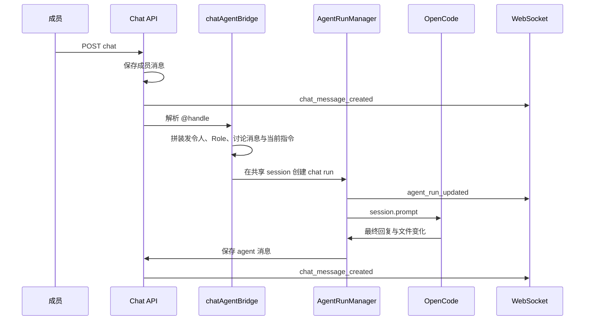

# 团队 Agent

团队 Agent 使用项目范围的共享 `AgentSession`。旧的个人 session 继续使用 `scope` 缺省值 `personal`，团队 session 使用 `scope: "team"`、项目内唯一的 `handle`，并把 `memberId` 保存为空字符串。团队 session 还保存可选的 `description` 与 `createdByMemberId`。`AgentRun.memberId` 始终保存本次发令成员，用于 Activity 与审计；团队 run 通过 `source: "chat"` 和 `chatMessageId` 关联聊天消息。聊天消息使用 `kind` 区分成员、Agent、系统消息，并可保存 `agentSessionId`、`runId` 与按出现顺序去重后的 `mentions`。

## 接口

- `GET /api/projects/:projectId/team-agents`：按需创建默认 `agent` 后返回全部团队 Agent。
- `POST /api/projects/:projectId/team-agents`：使用 `{ name, description? }` 创建团队 Agent。名称会通过 `normalizeHandle` 处理，重复 handle 返回 `409`。
- `GET /api/projects/:projectId/team-agents/:sessionId/runs`：读取指定团队 Agent 的全部 run。
- `GET /api/projects/:projectId/chat`：读取包含成员、Agent、系统消息的持久聊天记录。
- `POST /api/projects/:projectId/chat`：保存成员消息并广播 `chat_message_created`，随后解析提及并触发团队 run。

默认 Agent 只在第一次读取团队 Agent 列表或第一次创建团队 Agent 时创建。每个项目使用串行操作锁，避免并发请求写入两个 `agent` session。

## 聊天与运行

运行中的团队 Agent 再次被提及时，bridge 会查找同一 session 的 `queued` 或 `running` run。排队 run 直接取消；运行中 run 调用 `runtime.cancel`，OpenCode 会执行 `session.abort`。旧 run 写入 `cancelled`、`interruptedByRunId` 与 `interruptedByMemberId`，trace 写入 `run_interrupted`，随后在同一 session 创建新的 run，并保存一条 system 消息说明打断关系。

同一项目的个人 run 与团队 run 共用原有队列，每次只执行一个 run。Agent 完成后，服务端把最终输出保存为 `kind: "agent"` 的聊天消息，失败时保存 `kind: "system"` 的错误消息。消息与 run 都经过原有敏感信息清理流程。

## OpenCode 忙碌 session 的结论

当前服务端调用的是 SDK 的传统 `session.prompt`，它发送 `POST /session/{sessionID}/message`，类型定义没有 `delivery` 字段，也没有说明忙碌 session 会接受第二条消息。SDK 1.18.31 的 v2 接口另有 `client.v2.session.prompt`，请求体包含 `delivery?: "steer" | "queue"`，返回类型列出 `409 ConflictError`。这说明 OpenCode 提供了忙碌 session 的排队与 steer 接口，但传统 `session.prompt` 的行为无法据此保证。

本轮继续使用取消后重新提交的流程，保留旧 session 的工具调用记录。以后可以在验证 v2 接口的实际服务端行为后，把团队 Agent 升级为 steer 或 queue 模式。

## 已知局限

- KI-001 仍然存在，团队 Agent 与成员同时修改同一路径时继续使用现有的并发修改提示。
- 每个项目同时执行一个 Agent run，后续任务会进入项目队列。
- 团队 Agent 只支持新建，当前没有改名、删除和归档接口。
- 提及解析只匹配项目内团队 Agent 的 ASCII handle，邮箱地址和中文 `@` 文本会被忽略。
