# 过程性知识演示截图

日期：2026-10-09。分支：`feature/process-knowledge`。

每张图片左侧为 Alice 的深色主题窗口，右侧为 Bob 的浅色主题窗口。两名成员使用隔离的浏览器会话，连接同一个 Demo 工作区。图片由两张真实浏览器截图并排组成，保留原始网页内容，分辨率为 2888 × 1008。

演示使用独立数据目录 `artifacts/knowledge-demo/data-verified`。OpenCode Agent、规范导入、草稿生成和服务端复盘均使用实际配置的 MiniMax / `MiniMax-M3`。演示保留产品默认捕获条件。

## 实时协作

Alice 选中 `requestTimeoutMs`，Bob 选中 `canRetry`。两个窗口显示相同代码、协作者选区与讨论。演示过程中已验证：Alice 修改超时数值后，Bob 收到更新；Bob 修改重试条件后，Alice 收到更新。最终代码使用 5000 毫秒与三次重试。

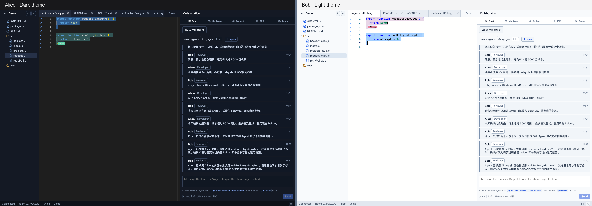

## 1. 手动创建知识卡片

操作：打开 README，进入“知识”，点击“新建”，填写类型、标题和内容，选择“整个文件”，保存。

示例卡片为“README 面向外部成员，统一使用英文”。保存后状态为有效、作用域为团队，来源为成员手动创建。关联整个文件后，修改 README 内容不会使这条文件规范进入待复核。

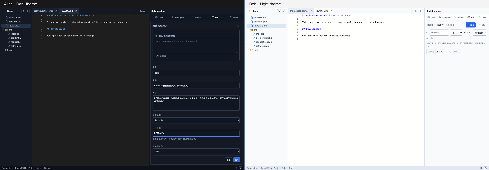

[查看保存后的卡片及来源](screenshots/demo-20261009/02-manual-saved.png)

## 2. 从规范文档导入原子草稿

操作：知识面板“更多” → “导入规范文档” → 输入 `AGENTS.md` → “生成导入草稿”。

模型实际生成 4 条独立草稿，保留原文和行号，等待成员确认：

- README 使用英文，保留代码标识符：第 3–5 行。
- 新增功能保持公共接口兼容：第 7–9 行。
- 修改 JavaScript 后运行 `npm test`：第 11–13 行。
- 时间字段使用 `Ms` 后缀，请求策略使用毫秒：第 15–17 行。

`llm-calls.jsonl` 中该次调用的 `mode` 为 `import`，耗时 12.911 秒，`completed: true`、`fallback: false`。这些导入建议在演示结束时保留为待确认草稿。

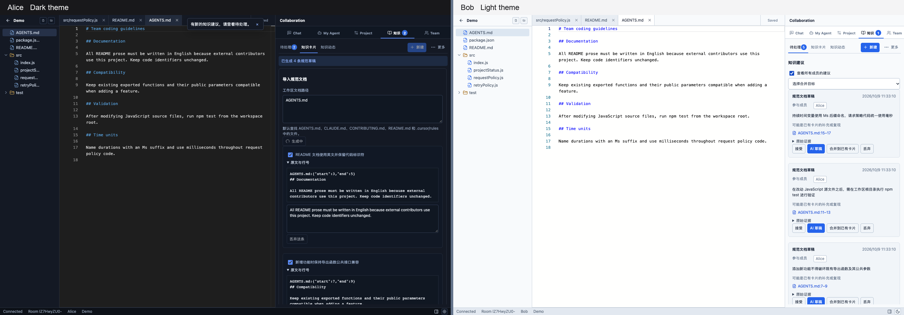

[查看模型生成中的界面](screenshots/demo-20261009/04-import-loading.png)；[查看收起原文后的多条草稿](screenshots/demo-20261009/06-import-overview.png)。

## 3. 从成员讨论和代码修改捕获知识

### 密集讨论

Alice 与 Bob 围绕超时单位、重试次数、公共 helper 和兼容性连续讨论。产品在 5 分钟窗口内累计 11 条成员消息后，等待 60 秒收集后续上下文，生成“协作讨论”建议。建议保留双方成员、聊天消息与关联代码候选。

操作：待处理 → “协作讨论” → “AI 草稿” → 核对内容和适用范围 → 确认。示例整理为“请求超时使用毫秒并集中配置”，正文记录讨论中明确确认的代码约定。

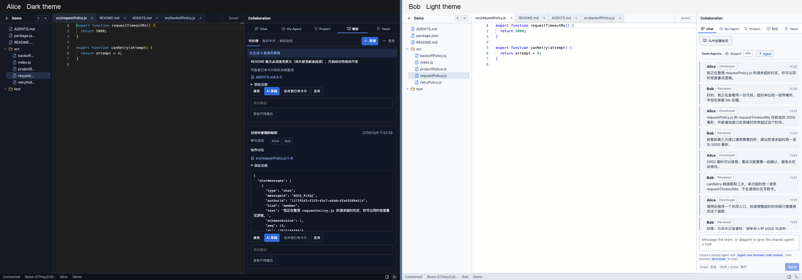

[查看成员核对草稿的界面](screenshots/demo-20261009/12-discussion-draft.png)。该图展示成员填写后的内容；来源和聊天引用继续保留。

### Magic number

Bob 在编辑器中把 `src/backoffPolicy.js` 的 `backoffDelayMs` 返回值从 `50` 修改为 `1500`，Alice 实时收到相同修改。默认 30 秒空闲检查点识别新增数字常量，并生成建议，证据包含文件、行号和修改前后内容。

操作：待处理 → “新增数字常量” → “AI 草稿” → 核对数值单位、使用场景与调整原因 → 确认。示例卡片为“调整 backoffDelayMs 时记录数值单位与原因”。当前证据没有提供选择 1500 的业务原因，卡片明确要求补充说明。

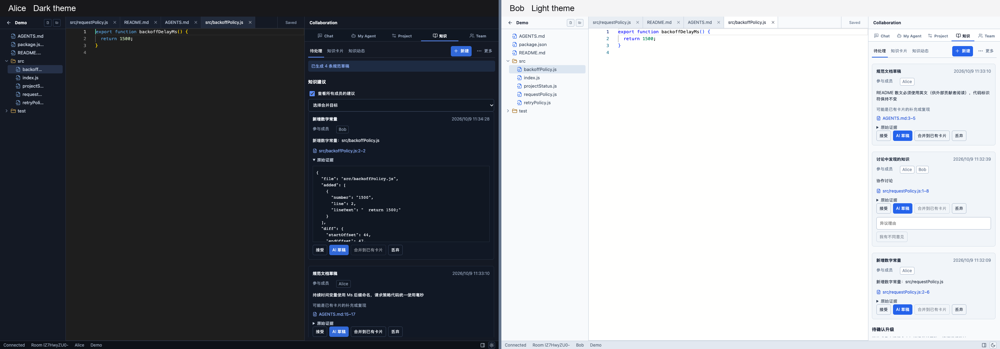

[查看成员核对数值含义与适用范围](screenshots/demo-20261009/13-magic-number-draft.png)。

## 4. 从成员纠正 Agent 捕获知识

同一个个人 Agent 会话中实际执行了两次任务：

1. Alice 要求 `retryNotification` 增加可选的 `onAttempt` 参数，并在函数内使用 `setTimeout` 等待。Agent 修改文件并运行测试。
2. Alice 追加纠正：要求复用已有的 `waitForRetry(delayMs)`，保留参数兼容性、导出和回调。Agent 完成修改并再次运行测试。

系统通过产品默认纠正词识别第二条指令，生成 `agent.corrected` 建议。建议关联两个 run：`swLlRj3fX7tr`、`m_3wR_Q9cs_1`。

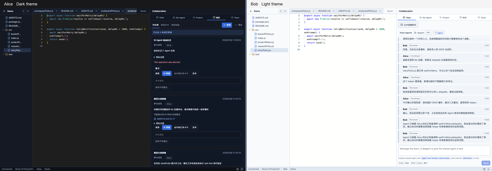

[查看第一轮 Agent 修改结果](screenshots/demo-20261009/10-agent-first-result.png)；[查看成员提交纠正指令](screenshots/demo-20261009/11-agent-correction.png)；[查看复盘生成中的反馈](screenshots/demo-20261009/15-agent-recap-loading.png)。

服务端复盘生成了“retryNotification 不得重复实现 setTimeout 等待”。规则指定文件、函数和调用方式，并说明不适用于 `waitForRetry` 自身实现的修改。生成的检查通过了纠正前后代码验证，记录为 `verified-before-and-after`。演示中通过重试完成了复盘请求，成功调用耗时 27.951 秒，`fallback: false`。

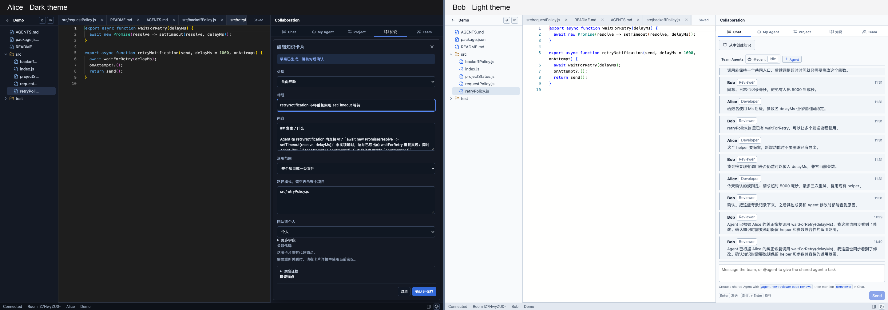

[查看人工确认后的来源与任务记录](screenshots/demo-20261009/17-agent-recap-confirmed.png)。这张卡片由 Alice 人工确认，保存为个人知识；Bob 的窗口用于展示共享代码和讨论。

确认时需要检查：规则是否指向实际被纠正的代码、适用范围是否合适、公共参数是否保持兼容、自动检查是否经过纠正前后的代码验证。

## 5. 成员阅读知识与就地提示

操作：知识面板“更多” → “生成示例卡片”，打开 `src/projectStatus.js`，在知识卡片列表选择“本文件”和“阅读顺序”。

系统生成决策、约束、风险、上下文、负向经验、教程六类示例。列表展示类型、状态、作用域、作者和更新时间；展开后可阅读正文、适用范围、来源、历史和 Agent 使用记录。

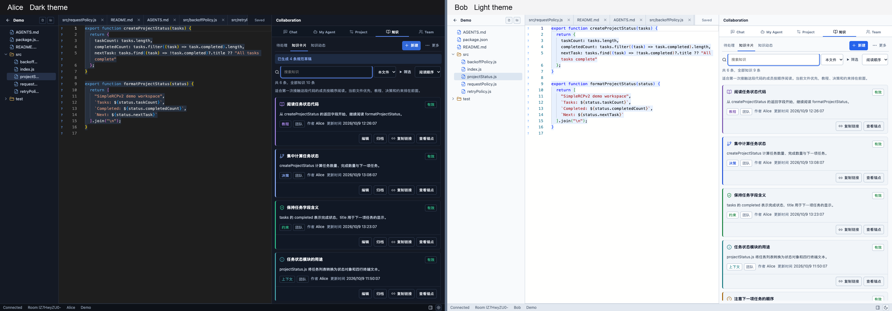

[查看展开后的卡片详情](screenshots/demo-20261009/19-knowledge-detail.png)。

在编辑器关联代码处显示知识提示，可以直接阅读标题、摘要、类型、作用域和状态，并通过“打开卡片”进入详情。

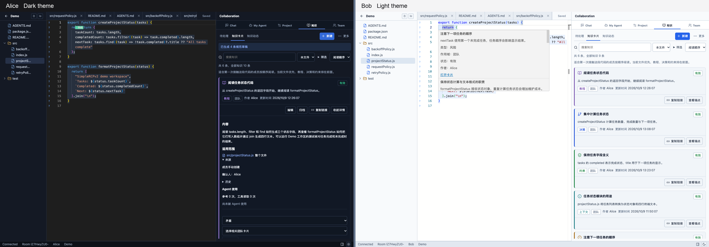

六类示例卡片用于说明界面与阅读方式；讨论、数字常量和 Agent 纠正的来源分别在前面的实际触发场景中展示。

## 6. 个人 Agent 任务前预览与实际参考

Bob 打开 README，在个人 Agent 面板填写完善文档的任务。提交前出现“将参考的知识”，可以逐条取消选择。本次预览包含 3 张卡片，其中包括团队的 README 英文规范。

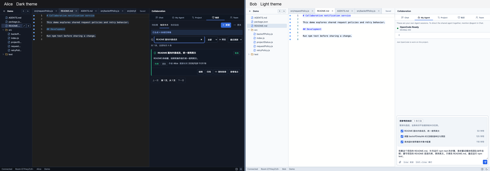

提交后，run `C7U1LkyD5P7s` 的 `knowledge_injected` 记录确认实际提供了相同的 3 张卡片，`activeFiles` 包含 `README.md`。任务卡片显示“本次参考的知识”，标题可以点击打开。

[查看任务实际参考的知识](screenshots/demo-20261009/22-agent-references.png)。

## 7. 任务后核对

任务完成后，系统识别出 README 修改涉及团队英文规范，记录文件 `README.md` 第 1–144 行，并显示“请人工核对”。该卡片没有自动语言检查，成员需要阅读文档确认语言和内容。

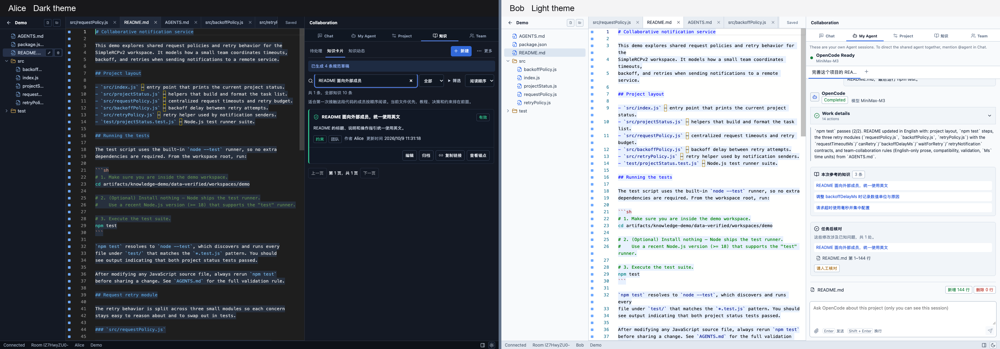

[查看项目知识动态](screenshots/demo-20261009/24-knowledge-activity.png)，可以继续追踪知识捕获、确认和应用。

## 验证记录

| 验证项目 | 结果 |
| --- | --- |
| 两名成员身份 | Alice 与 Bob 的成员编号不同，连接相同 room |
| 主题 | 左侧 `dark`，右侧 `light` |
| 实时编辑 | 双向同步通过，最终两个编辑器内容相同 |
| 规范导入 | 实际模型生成 4 条草稿，保留原文行号 |
| 成员协作捕获 | `chat.dense` 包含两名成员；`magicNumber.added` 包含 1500 的代码修改证据 |
| Agent 纠正捕获 | 实际连续任务触发 `agent.corrected`，关联两个 run |
| 复盘与确认 | 实际模型生成规则，自动检查验证通过，Alice 人工确认 |
| Agent 知识应用 | 任务前预览、实际注入、任务后核对均有界面和 trace 记录 |
| 实际 Agent 任务 | 3 次均为 `completed`，provider 为 `minimax`，model 为 `MiniMax-M3` |
| 工作区测试 | `node --test`：2 项通过，0 项失败 |
| 代码语法 | Demo 工作区所有 `src/*.js` 均通过 `node --check` |
| 图片 | 23 张并排截图，均由两个 1440 × 960 浏览器截图组成 |

本次新增截图与说明文档，产品代码保持原样。原始单窗口图片、演示脚本、模型调用记录、run trace 和验证结果保存在已忽略的 `artifacts/knowledge-demo/`，并排图片位于 [截图目录](screenshots/demo-20261009/)。

## 继续查看演示

服务运行期间可以访问 `http://127.0.0.1:5180/projects/demo`。成员身份保存在各自浏览器会话中，人工使用时可分别打开普通窗口和隐私窗口。

独立演示服务端使用以下配置，模型 Key 由本仓库已有的 `.env` 加载：

```sh
KNOWLEDGE=full
AGENT_LLM_PROVIDER=minimax
KNOWLEDGE_LLM_PROVIDER=minimax
PORT=4180
SIMPLERCP_OPENCODE_PORT=4196
SIMPLERCP_TERMINAL_ENABLED=false
SIMPLERCP_FAKE_AGENT_RUNTIME=false
SIMPLERCP_PUBLIC_URL=http://127.0.0.1:5180
SIMPLERCP_DATA_DIR=<仓库绝对路径>/artifacts/knowledge-demo/data-verified
```

客户端使用 `VITE_SIMPLERCP_API_ORIGIN=http://127.0.0.1:4180`、`VITE_SIMPLERCP_CLIENT_PORT=5180`。本机演示的启动与操作脚本保存在 `artifacts/knowledge-demo/`。
