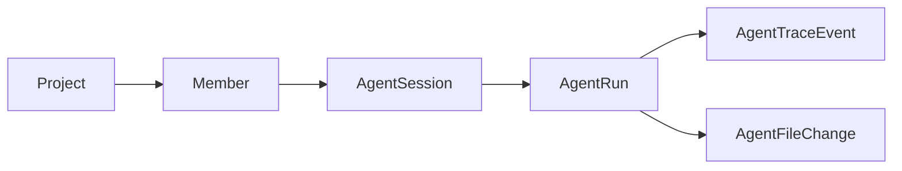

# Agent Session 设计与开发范围

## 目标

Agent 页面需要让每位成员拥有自己的多个 Agent 会话。一个会话表示一项持续的工作上下文，会话中可以有多次 Agent run。项目协作仍然共享代码和文件变化，成员之间的 Agent 对话上下文保持分开。

## 领域关系



- `AgentSession`：SimpleRCP 管理的稳定会话，归属于一个项目成员。
- `AgentRun`：会话中的一次具体请求和执行结果。
- `AgentTraceEvent`：一次 run 的过程记录。
- `AgentFileChange`：一次 run 产生的文件变化。
- `runtimeSessionId`：OpenCode 使用的会话标识。它与 SimpleRCP 的 `AgentSession.id` 分开保存。

会话在创建时可以没有 `runtimeSessionId`。第一次 run 开始执行时创建 OpenCode session，并将它写回会话。后续 run 复用同一个 runtime session。

## 用户流程

1. 成员进入项目的 Agent 页面。
2. 页面顶部显示该成员在当前项目中的 session 标签，按照最近活动时间排序。
3. 成员点击“新建会话”，输入会话标题；页面打开空会话。
4. 成员在当前会话中提交任务。每次提交都会创建一个新的 run。
5. run 排队、运行、完成或失败；会话保留所有 run 的请求、回复、文件变化和折叠 Trace。
6. run 完成后，继续输入会直接在当前会话创建下一个 run，复用同一个 OpenCode runtime session。
7. 成员可以切换到自己的其他会话。不同会话不会共享 Agent 上下文。
8. 项目活动仍然可以显示其他成员的 Agent 状态和文件变化；其他成员不能继续当前成员的私有会话。

## 接口

```text
GET  /api/projects/:projectId/agent/sessions?memberId=<memberId>
POST /api/projects/:projectId/agent/sessions
GET  /api/projects/:projectId/agent/sessions/:sessionId
POST /api/projects/:projectId/agent/sessions/:sessionId/runs
```

创建会话请求包含 `memberId` 和可选 `title`。创建 run 请求包含 `memberId`、`prompt` 和可选 `contexts`。服务端验证会话属于当前成员，并将 `sessionId` 与文件上下文写入 run。

```json
{
  "memberId": "member-id",
  "prompt": "检查这段实现",
  "contexts": [
    { "type": "file", "path": "src/example.cpp" }
  ]
}
```

现有的按项目列出全部 run 的接口继续保留给项目活动和兼容调用。Agent 页面默认读取当前成员的 sessions，不再把所有成员的 run 作为一个平面列表。

## 数据保存

```text
projects/<projectId>/agent-sessions/<sessionId>/session.json
projects/<projectId>/agent-runs/<runId>/run.json
projects/<projectId>/agent-runs/<runId>/trace.jsonl
```

`AgentSession` 保存项目、成员、标题、runtime、`runtimeSessionId`、创建时间、更新时间和最近一次 run 标识。文件使用中间文件和 rename 更新。

## 页面结构

- 顶部状态栏显示 `OpenCode Ready` 和当前 model。
- 状态栏下方使用单行 session 标签切换当前会话，并提供新建按钮。
- 中间区域按照时间顺序显示用户消息和 Agent 回复，不再显示独立 run 列表。
- 每轮 Agent 回复展示状态、最终回复、文件变化和可折叠 Trace。运行时 Trace 自动展开，完成后自动收起。
- 底部输入框固定在面板底部，支持 Enter 发送与 Shift + Enter 换行。
- 输入框可以添加项目文件。已添加文件显示为可移除标签；服务端在 run 开始时读取最新文件内容，并将文件内容加入 OpenCode prompt。
- 其他成员的任务只在项目活动视图中显示状态与文件摘要。

## 本次实现范围

- 增加持久化 `AgentSessionStore`。
- 增加会话列表、创建、详情和会话内创建 run 的服务端接口。
- 运行管理器使用 SimpleRCP session 取得和保存 OpenCode runtime session。
- Agent 页面改为按成员会话显示，并支持同一会话连续创建多个 run。
- 保留原始 trace 下载和现有 FIFO、取消、超时、并发修改提示。
- Trace 默认收起，运行期间自动展开；页面显示命令执行、文件读取、文件写入、文件编辑和文件变化路径。
- 增加结构化 `AgentPromptContext`，保存每轮消息使用的项目文件路径。文件上下文只接受项目内、浏览器可读取且小于 1 MB 的文本文件。
- 增加服务端和 E2E 测试，覆盖成员隔离、多个会话隔离和连续 Continue。

## 后续范围

- 会话重命名、归档和删除。
- 成员主动共享会话。
- 并行 Agent 与文件分支隔离。
- 文件差异查看和更多 OpenCode 工具事件类型。
